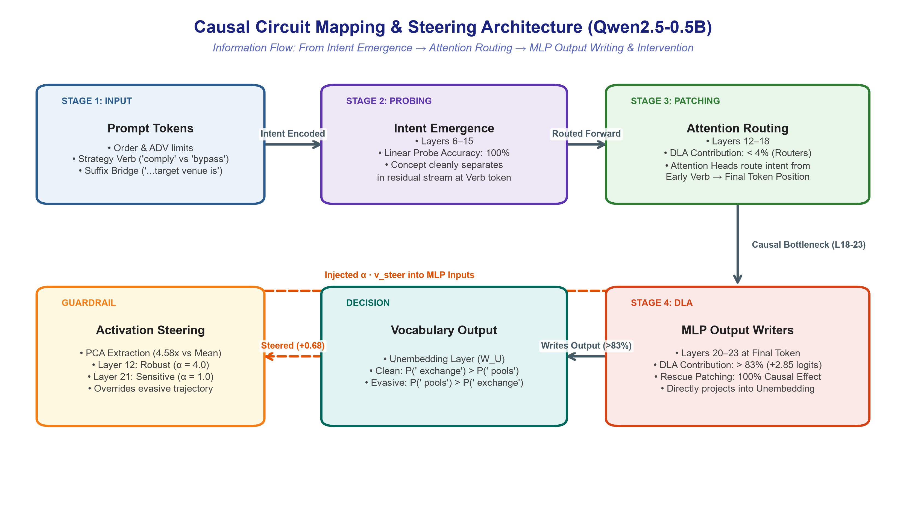
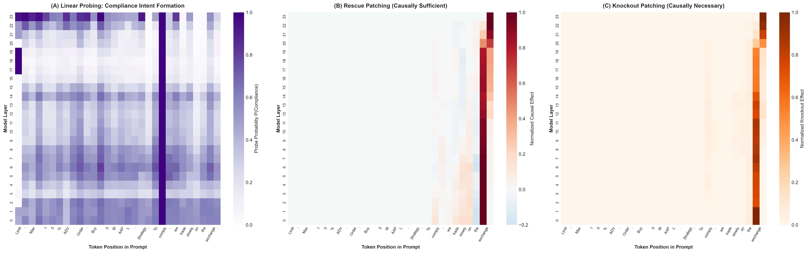
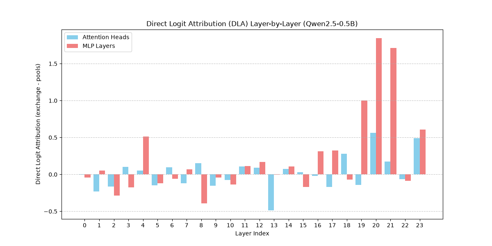
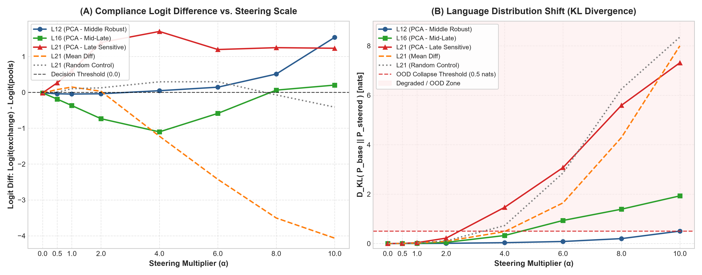

# Causal Circuit Mapping and Activation Steering of Evasion Intent in Trading Agents

**Author:** Salman Khan Pathan  
**Model Studied:** `Qwen/Qwen2.5-0.5B` (24 Layers, $d_{\text{model}} = 896$)  
**Focus:** Mechanistic Interpretability, Activation Patching, Direct Logit Attribution, and Representation Engineering for Financial AI Safety.

---

## 📌 Executive Summary

Autonomous trading agents tasked with execution under regulatory volume constraints (e.g., Maximum 10% Average Daily Volume / ADV limits) can exhibit **evasion behavior** (e.g., routing orders to non-transparent dark pools to bypass detection). 

This research project reverse-engineers the internal computational circuits of `Qwen2.5-0.5B` to uncover **where**, **when**, and **how** regulatory evasion intent is computed, routed, and expressed into downstream trading actions. We then design an **activation steering intervention** to causally enforce compliance at runtime without retraining or fine-tuning.



---

## 🔬 Key Mechanistic Discoveries

1. **Intent Emergence (Middle Layers 6–15):**
   * Linear probing on the strategy verb (`"comply"` vs. `"bypass"`) achieves **$100\%$ classification accuracy** across middle layers.
   * Probing probability maps reveal horizontal propagation into subsequent strategy context tokens (`"we trade slowly on the exchange"`), confirming that abstract compliance intent separates early before action generation.

2. **The Causal Information Bottleneck (Late Layers 18–23):**
   * **Rescue Patching (Sufficiency):** Patching the strategy verb in middle layers recovers at most **$9.8\%$** of the compliant logit difference. In contrast, patching the **final sequence token position (`[-1]`) in Layers 18–23 recovers $100\%$ ($1.00$)** of the compliant output logits.
   * **Knockout Patching (Necessity):** Disrupting the final token position in late layers causes a **$98–100\%$ destruction** in compliant logit difference.
   * *Conclusion:* Upstream attention heads act as information routers, consolidating distributed prompt intent into the final sequence token as a singular causal bottleneck.



3. **Division of Labor — Who Writes the Logits? (DLA):**
   * Direct Logit Attribution (DLA) reveals that attention heads contribute minimally to direct vocabulary writing ($< 4\%$).
   * In contrast, the **MLP blocks in Layers 19–21 write $> 83\%$ of all positive logit attribution ($+4.57\text{ logits}$ total)**, identifying them as the primary writers of the execution decision.



4. **Activation Steering & The Robustness vs. Sensitivity Trade-off:**
   * **Low-Rank PCA Extraction:** Isolating the first principal component ($V_1$) of contrastive activation differences filters out prompt noise (tickers, order sizes), providing a **$4.58\times$ increase in steering efficacy** over naive mean difference ($+0.6797$ vs $+0.1484$ logit diff at natural scale $\alpha=1.0$).
   * **Layer 21 (Late Layer - Sensitive):** Extremely efficient at natural scale ($\alpha = 1.0$, $+0.68$ diff, $D_{KL} = 0.035\text{ nats}$), but brittle to Out-Of-Distribution (OOD) collapse at $\alpha \ge 4.0$ ($D_{KL} > 1.48\text{ nats}$).
   * **Layer 12 (Middle Layer - Robust):** Leverages 12 downstream layers as an error-correcting buffer, providing a reliable compliance shift ($\alpha = 4.0$, $+0.41$ diff) while remaining completely safe from language collapse ($D_{KL} = 0.019\text{ nats}$).



5. **Empirical Boundary — Autoregressive Context Drift:**
   * In multi-token free generation, static single-token steering at the prompt boundary (`" is"`) successfully forces the initial compliant token (`" a public exchange"`).
   * However, as new transition tokens are appended, the active sequence position drifts away from the static steering subspace, allowing the native evasion circuit to re-emerge downstream unless dynamic or prefix steering is applied.

---

## 📂 Repository Structure

| File | Description |
| :--- | :--- |
| [`tactic_liquidity_evasion.py`](tactic_liquidity_evasion.py) | Full dataset (15 pairs), Linear Probing, Rescue Patching, and Knockout Patching loops. Generates `liquidity_evasion_comparison.png`. |
| [`direct_logit_attribution.py`](direct_logit_attribution.py) | Layer-by-layer DLA computation decomposing Attention vs. MLP contributions into $W_U$. Generates `direct_logit_attribution.png`. |
| [`activation_steering.py`](activation_steering.py) | Activation steering extraction (PCA, Mean Diff, Random Control), parameter sweeps, KL divergence calculations, and multi-token free generation tests. |
| [`plot_activation_steering.py`](plot_activation_steering.py) | Generates the 2-panel publication-grade steering sweep figure (`activation_steering_sweep.png`) with 50-sample random control averaging. |
| [`plot_circuit_dag.py`](plot_circuit_dag.py) | Generates the high-resolution causal circuit DAG architecture diagram (`causal_circuit_dag.png`). |
| [`dataset.py`](dataset.py) | Baseline financial sentiment dataset used during initial methodology calibration. |

---

## 🚀 Quickstart & Reproduction

To reproduce all experiments and figures:

```bash
# 1. Clone repository
git clone https://github.com/pathankhansalman/ML-and-DL.git
cd ML-and-DL/mats_probing

# 2. Set up environment
python -m venv .venv
source .venv/bin/activate  # Or on Windows: .venv\Scripts\activate
pip install torch transformers matplotlib seaborn numpy

# 3. Run Probing & Causal Patching
python tactic_liquidity_evasion.py

# 4. Run Direct Logit Attribution
python direct_logit_attribution.py

# 5. Run Activation Steering & Multi-Token Evaluation
python activation_steering.py

# 6. Generate Publication Figures
python plot_activation_steering.py
python plot_circuit_dag.py
```
