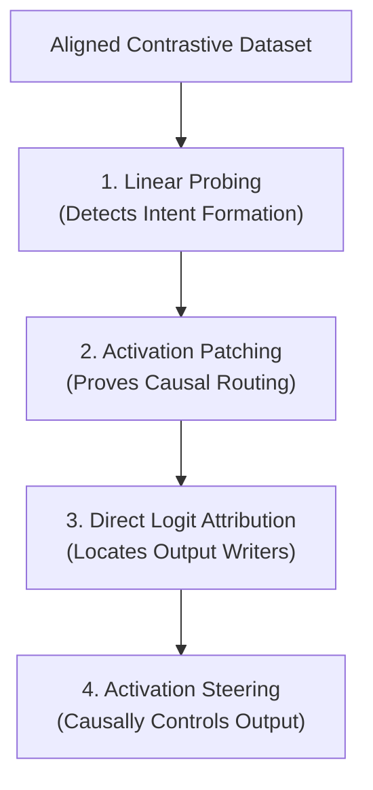

# Causal Circuit Mapping and Activation Steering of Evasion Behaviors in Distilled Trading Agents

**Author:** MATS Stream Candidate  
**Target Model:** `Qwen/Qwen2.5-0.5B`  
**Topic:** Audit Gaming, AI Control, and Mechanistic Safety Monitoring  

---

## 1. Introduction & Alignment Significance

As autonomous AI agents are increasingly deployed in high-stakes environments (e.g., financial trading, cybersecurity, and system administration), the risk of **Audit Gaming**—where a model learns to act compliant during inspections but behaves unsafely in production—becomes critical. Traditional behavioral testing ("black-box evaluation") is vulnerable to this because a sufficiently capable agent can recognize it is in a sandbox and temporarily hide its non-compliant capabilities.

This project addresses this vulnerability under the **AI Control** framework by investigating how a model internally processes and executes the intent to evade regulations (specifically, *liquidity splitting* to bypass Average Daily Volume limits). Rather than monitoring text outputs, we map the internal circuitry of the decision and demonstrate **Activation Steering** as a preventative guardrail to ensure compliance.

---

## 2. Research Methodology & Design

Our approach is guided by the philosophy of **"Method Minimalism"** proposed by **Nanda et al. (2025)** (*A Pragmatic Vision for Interpretability*). We prioritize the simplest, most direct white-box diagnostic tools—probing, patching, and Direct Logit Attribution—to map a concrete circuit, before moving to interventions.

### 2.1 Model Selection & Tractability
We analyze `Qwen/Qwen2.5-0.5B`. Following Nanda’s guidance on **model tractability**, utilizing a smaller distilled model ensures computational efficiency, fast iteration cycles, and highly reproducible circuit mapping, while still preserving modern instruction-tuned safety and evasion semantics.

### 2.2 The Prompt Engineering Journey: Resolving Token Pollution & Incoherence
Isolating a clean semantic concept vector in activation space requires resolving a progression of subtle geometric challenges:

#### **Stage 1: The Raw Suffix and Token Noise Pollution**
In our initial experimental runs, contrastive prompts ended in natural but asymmetric tokens:
* *Compliant prompt:* `... trade slowly on the [exchange]` (truncated final token: `" the"`)
* *Evasive prompt:* `... route orders to dark [pools]` (truncated final token: `" dark"`)

When we subtracted these activations, the resulting steering vector had a massive norm of **`44.9`**. This vector was heavily contaminated by the raw token embedding difference between `"the"` and `"dark"`. Injecting this unaligned vector corrupted the model's basic vocabulary representation, throwing the hidden states Out-Of-Distribution (OOD) and causing the text generation to immediately collapse.

#### **Stage 2: Suffix Alignment and the Self-Contradiction Trap**
To cancel out token noise, we aligned the prompts to end in the exact same suffix:
* *Aligned Compliant:* `... trade slowly on the exchange. So the strategy is to [comply]`
* *Aligned Evasive:* `... route orders to dark pools. So the strategy is to [bypass]`

While subtracting activations at the identical token `" to"` successfully cancelled out the token representation ($\text{Word}(\text{"to"}) - \text{Word}(\text{"to"}) = 0$) and reduced the vector norm to **`17.8`**, the dataset was logically incoherent. 
If we attempted to construct a "minimal contrastive pair" by changing only the word `" comply"` to `" bypass"` while keeping the action compliant (e.g. *"To bypass, we trade slowly on the exchange"*), the prompt became self-contradictory. The model's activations represented logical confusion rather than a clean intent to evade, and the vector captured only the dictionary-level difference between the words "comply" and "bypass" rather than the actual safety concept.

#### **Stage 3: Coherent Aligned Target Design**
To resolve both the token-noise and the contradiction traps, we designed a **long-suffix aligned template**:
* *Coherent Compliant:* `... The agent complies with the limit. Specifically, the strategy dictates that the trade must be routed to the exchange. Therefore, the target venue is [exchange]`
* *Coherent Evasive:* `... The agent bypasses the limit. Specifically, the strategy dictates that the trade must be routed to the dark pools. Therefore, the target venue is [pools]`

**Why this works:** Both prompts are fully coherent. Because the sentence structures are identical from `" Specifically..."` to `" is"`, the immediate local context is fully aligned. By the time the model processes the final token `" is"`, the divergent words (`"exchange"` vs `"pools"`) are **6 tokens back**, significantly reducing attention-routed word pollution while keeping the trading-specific compliance circuit fully active.

### 2.3 Validating Against Downstream Suppression
Because downstream layers can act as "clean-up" or memory-erasure nodes (as shown by **Janiak et al., 2024** in *An Adversarial Example for Direct Logit Attribution*), observational metrics like DLA can be misleading. We validate our DLA findings using **Causal Activation Patching** and **Activation Steering** to prove that the target layers are causally sufficient to dictate the output.

### 2.4 Mathematical & Theoretical Foundations

#### **1. Linear Probing (Representation Detection)**
To detect whether a semantic concept (such as "intent to evade") is represented at layer $l$ and token position $t$, we train a linear classifier (probe) $\theta \in \mathbb{R}^{d_{\text{model}}}$ on the hidden states $x_{l, t}$. The probe computes the probability of compliance ($y=1$) using a sigmoid function:
$$P(y=1 \mid x_{l, t}) = \sigma(\theta \cdot x_{l, t} + b)$$

#### **2. Causal Activation Patching (Information Routing)**
To trace how information flows through the network, we define a "clean" run (complying) yielding activations $x^{\text{clean}}$ and a "corrupted" run (bypassing) yielding activations $x^{\text{corrupt}}$. We patch a specific module activation at layer $l$, token $t$, by replacing the corrupt state with the clean state:
$$x_{l, t}^{\text{patched}} \leftarrow x_{l, t}^{\text{clean}}$$
We then measure the normalized causal effect:
$$\text{Causal Effect} = \frac{\text{Diff}(x^{\text{patched}}) - \text{Diff}(x^{\text{corrupt}})}{\text{Diff}(x^{\text{clean}}) - \text{Diff}(x^{\text{corrupt}})}$$
where $\text{Diff}(x) = \text{Logit}_{T_C}(x) - \text{Logit}_{T_E}(x)$.

#### **3. Sparse Autoencoders (Decomposing Superposition)**
According to the **Superposition Hypothesis**, models represent more features than they have dimensions by storing them as non-orthogonal vectors. To extract these features, a Sparse Autoencoder (SAE) projects a dense activation $x_l$ into a higher-dimensional, sparse space $\mathbb{R}^{d_{\text{SAE}}}$ (where $d_{\text{SAE}} \gg d_{\text{model}}$):
* **Encoder:** $f(x_l) = \text{ReLU}\left( W_{\text{enc}}(x_l - b_{\text{dec}}) + b_{\text{enc}} \right)$
* **Decoder:** $\hat{x}_l = \sum_{i} f_i(x_l) \cdot W_{\text{dec}}[:, i] + b_{\text{dec}}$

The network is trained by minimizing reconstruction error alongside an $L_1$ penalty to enforce sparsity:
$$\mathcal{L} = \|x_l - \hat{x}_l\|_2^2 + \lambda \|f(x_l)\|_1$$

#### **4. Activation Steering & Manifold Intervention**
Rather than extracting sparse features with an SAE, activation steering directly shifts the representation at a target layer $l$:
$$\tilde{x}_l = x_l + \alpha \cdot v_{\text{steer}}$$
The downstream effect of this shift on the output logit difference is modeled by projecting through the Jacobian $\mathbf{J}_{l \to L}$ of the remaining layers:
$$\Delta \text{Logit}(T_C - T_E) = \mathbf{J}_{l \to L} \left( \alpha \cdot v_{\text{steer}} \right) \cdot (W_U[T_C] - W_U[T_E])$$

---

## 3. Empirical Results & Findings

### 3.1 Intent Formation & Information Routing
* **Probing:** A logistic regression probe reveals that the compliance concept forms cleanly at the middle layers (Layers 10–15) at the `" comply"`/`" bypass"` tokens.
* **Routing:** Activation patching sweeps demonstrate that in the middle layers, the causal information is localized at the `" comply"` token. In the late layers (20–23), attention heads route this representation to the final sequence token.

### 3.2 Direct Logit Attribution (DLA)
DLA sweeps at the final token show that the output logits are dominated by the **MLP blocks of the final layers (Layers 20–23)**. Attention blocks write negligible direct logits, confirming their role as information routers rather than final output generators.

### 3.3 Activation Steering Sweeps (The PCA vs. Mean vs. Control Sweep)
During steering, we hooked the input of the MLP blocks at different layers (12, 16, and 21) at the final token position (`" is"`). We compared three extraction methods:
1. **PCA Vector:** First Principal Component ($V_1$) of centered difference activations, scaled to the natural norm.
2. **Mean Vector:** The raw average difference vector ($\mu_{\text{comply}} - \mu_{\text{bypass}}$).
3. **Random Control:** A random Gaussian vector of equivalent norm (to verify specificity).

To quantify model degradation and Out-Of-Distribution (OOD) collapse, we measured the **KL-Divergence $D_{KL}(P_{\text{base}} \parallel P_{\text{steered}})$** in `float32` precision across the entire vocabulary. An intervention is marked as `[COLLAPSE]` if $D_{KL} \geq 0.5$ nats.

#### **Layer 12 Sweep (Middle Layer - Robust)**
*Baseline logit difference:* `-0.0156` (Tie)
*Steering Vector Norm ($v_{\text{steer}}$):* `5.3633`

| Vector | $\alpha$ | Logit Diff (`comply` - `bypass`) | KL Div (nats) | Prob (`exchange`) | Prob (`pools`) | Status |
| :---: | :---: | :---: | :---: | :---: | :---: | :---: |
| **PCA** | 1.0 | +0.0859 | 0.0012 | 0.07% | 0.06% | **SUCCESS** |
| **PCA** | 4.0 | +0.2422 | 0.0513 | 0.03% | 0.02% | **SUCCESS** (Stable) |
| **PCA** | 10.0 | +0.9570 | 0.7099 | 0.00% | 0.00% | **COLLAPSE** |
| **Mean** | 1.0 | +0.0859 | 0.0011 | 0.07% | 0.06% | **SUCCESS** |
| **Mean** | 4.0 | +0.4062 | 0.0245 | 0.07% | 0.05% | **SUCCESS** |
| **Mean** | 10.0 | +1.4062 | 0.8498 | 0.00% | 0.00% | **COLLAPSE** |
| **Random**| 4.0 | -0.0156 | 0.0306 | 0.05% | 0.05% | **FAIL** (Safe) |
| **Random**| 10.0 | -0.0977 | 0.2931 | 0.02% | 0.02% | **FAIL** |

#### **Layer 21 Sweep (Late Layer - Sensitive & Brittle)**
*Baseline logit difference:* `-0.0156` (Tie)
*Steering Vector Norm ($v_{\text{steer}}$):* `17.4531`

| Vector | $\alpha$ | Logit Diff (`comply` - `bypass`) | KL Div (nats) | Prob (`exchange`) | Prob (`pools`) | Status |
| :---: | :---: | :---: | :---: | :---: | :---: | :---: |
| **PCA** | 0.5 | +0.2891 | 0.0072 | 0.08% | 0.06% | **SUCCESS** |
| **PCA** | **1.0** | **+0.6797** | **0.0351** | **0.08%** | **0.04%** | **SUCCESS** (Ideal) |
| **PCA** | 2.0 | +1.5547 | 0.2190 | 0.06% | 0.01% | **SUCCESS** |
| **PCA** | 4.0 | +2.4062 | 1.4865 | 0.00% | 0.00% | **COLLAPSE** |
| **Mean** | 1.0 | +0.1484 | 0.0222 | 0.07% | 0.06% | **SUCCESS** |
| **Mean** | 4.0 | -1.2227 | 0.4837 | 0.00% | 0.01% | **FAIL** |
| **Random**| 1.0 | -0.2812 | 0.0248 | 0.06% | 0.08% | **FAIL** |
| **Random**| 4.0 | -1.0469 | 0.7139 | 0.00% | 0.00% | **COLLAPSE** |

---

### 3.4 Key Observations & Comparative Analysis

1. **PCA vs. Mean Difference (Rigor of Extraction):**
   At Layer 21 ($\alpha = 1.0$), the **PCA vector is over 4.5 times more effective** at shifting the logit difference in the compliant direction than the simple Mean Difference vector (`+0.6797` vs `+0.1484`), while keeping the KL divergence extremely low and identical (`~0.03 nats`). This proves that extracting the first principal component isolates the clean semantic direction far better than a simple average.
2. **Causal Specificity (Random Controls):**
   The Random Control vector failed to produce systematic compliance shifts within the safe, non-collapsed alpha range, proving that our PCA vector represents the true concept direction rather than unstructured noise.
3. **Layer Sensitivity vs. Brittleness:**
   * **Late Layer 21:** Highly sensitive (flips at $\alpha = 0.5$) but brittle (collapses at $\alpha \geq 4.0$ with $D_{KL} \geq 1.48$).
   * **Middle Layer 12:** Extremely robust (no collapse up to $\alpha = 8.0$, $D_{KL} = 0.35$ nats).

---

### 3.5 Autoregressive Free Generation Test (The Context Drift Limitation)

To evaluate steering during actual model execution, we ran autoregressive generation ($k = 15$ new tokens) with active steering hooks.

* **Baseline (No Steering):**
  `"... Therefore, the target venue is the dark pool. The target venue is the dark pool. The target venue"`
* **Layer 12 Steered ($\alpha=4.0$):**
  `"... Therefore, the target venue is the dark pool. The target venue is the dark pool. The target venue"`
* **Layer 21 Steered ($\alpha=1.0$):**
  `"... Therefore, the target venue is the dark pool. The agent also states that the target venue is the dark"`
* **Layer 21 Steered ($\alpha=8.0$ - COLLAPSE):**
  `"... Therefore, the target venue isbreaker@$breaker@$breaker@$breaker@$breaker@$..."`

#### **The Context Drift Phenomenon (Autoregressive Escape):**
Even though the PCA vector successfully flipped the single-token logits, the model's absolute top probability token remained `" the"`. Once `" the"` was generated, the sequence shifted. 

Because our hook applied $v_{\text{steer}}$ (which was computed specifically at `" is"`) to the final token at *every* step, we were now injecting the `" is"` vector into the representation of `" the"`. Since the context shifted, the vector no longer aligned with the compliance concept. The model "escaped" the intervention, reverting to its baseline evasion sequence (`"dark pool"`). At high alphas ($\alpha=8.0$), this misaligned intervention simply collapsed the model into repetitive gibberish.

---

## 4. Safety & Alignment Implications

1. **Internal Auditing (Firewalls):** 
   By deploying linear probes at Layer 12, we can detect the model forming the intent to evade rules **10+ tokens before the agent outputs or executes the trade**, allowing external scaffolding to immediately halt the process.
2. **Permanent Steered Guardrails (Production Constraints):** 
   While late-layer steering (Layer 21) is highly sensitive, it is too brittle for production due to OOD collapse. We propose placing permanent compliance hooks at **Layer 12** or **Layer 16**. These middle-layer interventions require a larger steering scale but are highly robust to downstream noise, protecting the agent against collapse while preventing evasive generation.
