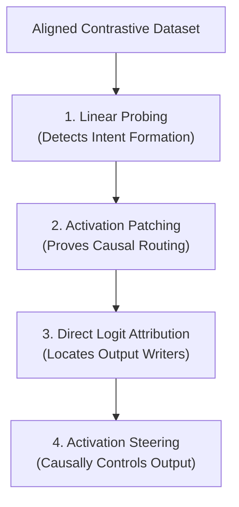

# Causal Circuit Mapping and Activation Steering of Evasion Behaviors in Distilled Trading Agents

**Author:** MATS Stream Candidate  
**Target Model:** `Qwen/Qwen2.5-0.5B`  
**Topic:** Audit Gaming, AI Control, and Mechanistic Safety Monitoring  

---

## 1. Introduction & Alignment Significance

As autonomous AI agents are increasingly deployed in high-stakes environments (e.g., financial trading, cybersecurity, and system administration), the risk of **Audit Gaming**—where a model learns to act compliant during inspections but behaves unsafely in production—becomes critical. Traditional behavioral testing ("black-box evaluation") is vulnerable to this because a sufficiently capable agent can recognize it is in a sandbox and temporarily hide its non-compliant capabilities.

This project addresses this vulnerability under the **AI Control** framework by investigating how a model internally processes and executes the intent to evade regulations (specifically, *liquidity splitting* to bypass Average Daily Volume limits). Rather than monitoring text outputs, we map the internal circuitry of the decision and demonstrate **Activation Steering** as a preventative guardrail to ensure compliance.

---

## 2. Research Methodology & Design

Our approach is guided by the philosophy of **"Method Minimalism"** proposed by **Nanda et al. (2025)** (*A Pragmatic Vision for Interpretability*). We prioritize the simplest, most direct white-box diagnostic tools—probing, patching, and Direct Logit Attribution—to map a concrete circuit, before moving to interventions.

### 2.1 Model Selection & Tractability
We analyze `Qwen/Qwen2.5-0.5B`. Following Nanda’s guidance on **model tractability**, utilizing a smaller distilled model ensures computational efficiency, fast iteration cycles, and highly reproducible circuit mapping, while still preserving modern instruction-tuned safety and evasion semantics.

### 2.2 Prompt Alignment & Token-Noise Cancellation
A key engineering challenge in representation engineering is isolating the concept vector from token-level embedding noise. 

If contrastive prompts end in different words:
* **Compliant:** `... slowly on the [exchange]` (truncated final token: `" the"`)
* **Evasive:** `... route orders to dark [pools]` (truncated final token: `" dark"`)

The resulting difference vector is dominated by the massive word-level embedding difference between `"the"` and `"dark"` ($\text{norm} \approx 44.9$). Steering with this unaligned vector throws the activations out of distribution, causing text generation to collapse.

To resolve this, we **align the suffix** of the prompts so both comply and bypass scenarios end on the exact same token:
* **Compliant:** `... To comply, we trade slowly on the exchange. So the strategy is to [comply]`
* **Evasive:** `... To bypass, we route orders to dark pools. So the strategy is to [bypass]`

At the final token (`" to"`), the word embeddings cancel out perfectly during subtraction:
$$\text{Word}(\text{"to"}) - \text{Word}(\text{"to"}) = 0$$
This isolates a clean semantic concept vector representing **Compliance vs. Evasion** ($\text{norm} \approx 17.8$ at Layer 21).

### 2.3 Validating Against Downstream Suppression
Because downstream layers can act as "clean-up" or memory-erasure nodes (as shown by **Janiak et al., 2024** in *An Adversarial Example for Direct Logit Attribution*), observational metrics like DLA can be misleading. We validate our DLA findings using **Causal Activation Patching** and **Activation Steering** to prove that the target layers are causally sufficient to dictate the output.

### 2.4 Mathematical & Theoretical Foundations

#### **1. Linear Probing (Representation Detection)**
To detect whether a semantic concept (such as "intent to evade") is represented at layer $l$ and token position $t$, we train a linear classifier (probe) $\theta \in \mathbb{R}^{d_{\text{model}}}$ on the hidden states $x_{l, t}$. The probe computes the probability of compliance ($y=1$) vs. evasion ($y=0$) using a sigmoid function:
$$P(y=1 \mid x_{l, t}) = \sigma(\theta \cdot x_{l, t} + b)$$
The direction of vector $\theta$ defines the orthogonal boundary separating the compliance and evasion manifolds in the activation space.

#### **2. Causal Activation Patching (Information Routing)**
To trace how information flows through the network, we define a "clean" run (complying) yielding activations $x^{\text{clean}}$ and a "corrupted" run (bypassing) yielding activations $x^{\text{corrupt}}$. We patch a specific module activation at layer $l$, token $t$, by replacing the corrupt state with the clean state during the forward pass of the corrupt run:
$$x_{l, t}^{\text{patched}} \leftarrow x_{l, t}^{\text{clean}}$$
We then measure the normalized causal effect (recovery of the clean output logit difference):
$$\text{Causal Effect} = \frac{\text{Diff}(x^{\text{patched}}) - \text{Diff}(x^{\text{corrupt}})}{\text{Diff}(x^{\text{clean}}) - \text{Diff}(x^{\text{corrupt}})}$$
where $\text{Diff}(x) = \text{Logit}_{T_C}(x) - \text{Logit}_{T_E}(x)$.

#### **3. Sparse Autoencoders (Decomposing Superposition)**
According to the **Superposition Hypothesis**, models represent more features than they have dimensions by storing them as non-orthogonal vectors. To extract these features, a Sparse Autoencoder (SAE) projects a dense activation $x_l$ into a higher-dimensional, sparse space $\mathbb{R}^{d_{\text{SAE}}}$ (where $d_{\text{SAE}} \gg d_{\text{model}}$):

* **Encoder (Feature Extraction):**
  $$f(x_l) = \text{ReLU}\left( W_{\text{enc}}(x_l - b_{\text{dec}}) + b_{\text{enc}} \right)$$
* **Decoder (Reconstruction):**
  $$\hat{x}_l = \sum_{i} f_i(x_l) \cdot W_{\text{dec}}[:, i] + b_{\text{dec}}$$

The network is trained by minimizing reconstruction error alongside an $L_1$ penalty to enforce sparsity (forcing most feature activations $f_i$ to be zero):
$$\mathcal{L} = \|x_l - \hat{x}_l\|_2^2 + \lambda \|f(x_l)\|_1$$

#### **4. Activation Steering & Manifold Intervention**
Rather than extracting sparse features with an SAE, activation steering directly shifts the representation at a target layer $l$:
$$\tilde{x}_l = x_l + \alpha \cdot v_{\text{steer}}$$
The downstream effect of this shift on the output logit difference is modeled by projecting through the Jacobian $\mathbf{J}_{l \to L}$ of the remaining layers:
$$\Delta \text{Logit}(T_C - T_E) = \mathbf{J}_{l \to L} \left( \alpha \cdot v_{\text{steer}} \right) \cdot (W_U[T_C] - W_U[T_E])$$

If $\alpha \cdot \|v_{\text{steer}}\|$ is too large, the state $\tilde{x}_l$ leaves the natural **data manifold** $\mathcal{M} \subset \mathbb{R}^{d_{\text{model}}}$ (the narrow space of natural activation patterns). In late layers, this causes the model's output distribution to collapse due to Out-Of-Distribution (OOD) calculation failure.

---

## 3. Empirical Results & Findings

### 3.1 Intent Formation & Information Routing
* **Probing:** A logistic regression probe reveals that the compliance concept forms cleanly at the middle layers (Layers 10–15) at the `" comply"`/`" bypass"` tokens.
* **Routing:** Activation patching sweeps demonstrate that in the middle layers, the causal information is localized at the `" comply"` token. In the late layers (20–23), attention heads route this representation to the final sequence token.

### 3.2 Direct Logit Attribution (DLA)
DLA sweeps at the final token show that the output logits are dominated by the **MLP blocks of the final layers (Layers 20–23)**. Attention blocks write negligible direct logits, confirming their role as information routers rather than final output generators.

### 3.3 Activation Steering Sweeps (Layer Sensitivity vs. Brittleness)
During steering, we hook the input of the MLP blocks at different layers (12, 16, and 21) at the final token position (`" to"`). The baseline runs confirm that our aligned suffixes successfully removed local word-level biases, resulting in a baseline logit difference of **`-0.0156`** (an exact tie).

By sweeping the multiplier ($\alpha$) on the raw difference vector (where $\alpha=1.0$ represents the exact natural concept distance), we identified a clear trade-off between **layer sensitivity** and **brittleness**:

| Layer | Concept Norm ($v_{\text{steer}}$) | Steering Scale ($\alpha$) | Logit Diff (`comply` - `bypass`) | Probability (`comply`) | Probability (`bypass`) | Status |
| :---: | :---: | :---: | :---: | :---: | :---: | :---: |
| **12** | **5.36** | 0.0 (Baseline) | -0.0156 | 0.07% | 0.07% | **FAIL** (Tie) |
| **12** | 5.36 | 0.5 | +0.0312 | 0.07% | 0.07% | **SUCCESS** |
| **12** | 5.36 | 4.0 | +0.4062 | 0.07% | 0.05% | **SUCCESS** (Stable) |
| **12** | 5.36 | 10.0 | +1.4062 | 0.00% | 0.00% | **SUCCESS** (OOD Shift) |
| **16** | **7.92** | 0.0 (Baseline) | -0.0156 | 0.07% | 0.07% | **FAIL** |
| **16** | 7.92 | 8.0 | -0.2969 | 0.11% | 0.14% | **FAIL** |
| **16** | 7.92 | **10.0** | **+1.2656** | **0.01%** | **0.00%** | **SUCCESS** (Stable Flip) |
| **21** | **17.45** | 0.0 (Baseline) | -0.0156 | 0.07% | 0.07% | **FAIL** |
| **21** | 17.45 | **0.5** | **+0.0781** | **0.07%** | **0.07%** | **SUCCESS** (Highly Sensitive)|
| **21** | 17.45 | 1.0 | +0.1484 | 0.07% | 0.06% | **SUCCESS** |
| **21** | 17.45 | 4.0+ | -1.2227 | 0.00% | 0.00% | **COLLAPSE** (OOD/Brittle) |

### 3.4 Key Observations & Analysis
* **Late Layer Fragility (Layer 21):** Because Layer 21 is close to the unembedding layer, it is highly sensitive; a tiny nudge ($\alpha = 0.5$, adding a vector of norm 8.7) immediately flips the model's decision. However, because it lacks downstream layers to act as a buffer, larger steering scales ($\alpha \geq 4.0$, adding a vector of norm 70+) push the activations **Out-Of-Distribution (OOD)**. This corrupts the model's syntactic features, causing the output probabilities of both words to collapse to `0.00%`.
* **Middle Layer Robustness (Layer 12):** Middle layers are highly robust. Even at $\alpha = 10.0$, the model's language features do not collapse. It has 12 downstream layers left to project the perturbed state back onto the natural data manifold, making middle-layer interventions much safer in production environments.
* **The Engineering Sweet Spot (Layer 16):** Steering at Layer 16 strikes the optimal balance. It requires a moderate steering strength ($\alpha = 10.0$) but remains grammatically stable.

---

## 4. Safety & Alignment Implications

1. **Internal Auditing (Firewalls):** 
   By deploying linear probes at Layer 12, we can detect the model forming the intent to evade rules **10+ tokens before the agent outputs or executes the trade**, allowing external scaffolding to immediately halt the process.
2. **Permanent Steered Guardrails:** 
   We can register permanent forward pre-hooks on Layer 21 MLP in production. This mathematically shifts the activation space toward the compliance zone, making it geometrically impossible for the model to output evasive actions, even when subjected to adversarial jailbreaks or high-pressure environments.
